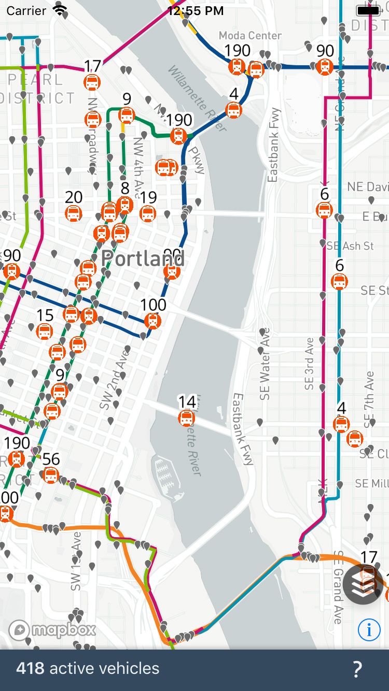
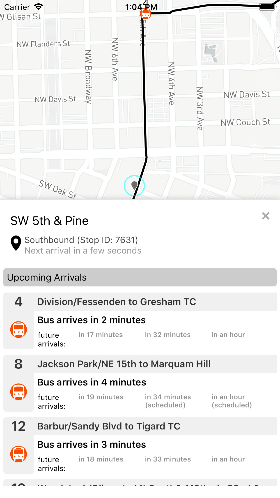

<br />

[![Build Status][travis_image]][travis]

Trimetric Mobile is a [React Native] app that pulls data from a [Go backend server][trimetric server]
to provide a real-time visualization of Portland's [Trimet] transit system.

You can download the app from [Google Play] or the [iOS App Store]. You can also
view a web version of the same visualization at http://trimtric.briand.co.

### Screenshots




### Setup

You can run your own build of Trimetric mobile using the standard [React Native tools]. The requirements are the same as any React Native project, with the added requirement of a [Mapbox Access Token].

# Getting started

First, clone the repo:

```sh
git clone https://github.com/bsdavidson/trimetric-mobile.git
cd trimetric-mobile
yarn install
```

Copy `secrets.js.example` to `secrets.js` and add your Mapbox access token.

By default, the apps will connect to the Trimetric server running on https://trimetric.briand.co. If you are running your own server, edit `data.js` and change this line to point to your running instance:

```javascript
const BASE_URL = "https://trimetric.briand.co";
```

### Running

To run it in an iOS simulator:

```sh
react-native run-ios
```

If you have ADB installed and a properly configured Android device, you can run it there by typing:

```sh
react-native run-android
```

### Testing

You can run tests by typing:

```sh
yarn test
```

[trimet]: https://trimet.org
[google play]: https://play.google.com/store/apps/details?id=com.trimetric_mobile
[ios app store]: https://itunes.apple.com/us/app/trimetric-mobile/id1336258424
[gtfs]: https://developers.google.com/transit/
[mapbox]: https://www.mapbox.com/
[mapbox access token]: https://www.mapbox.com/signup/
[trimetric server]: https://github.com/bsdavidson/trimetric
[trimet api key]: https://developer.trimet.org/appid/registration/
[react native]: https://facebook.github.io/react-native/
[react native tools]: https://facebook.github.io/react-native/docs/getting-started.html
[travis]: https://travis-ci.org/bsdavidson/trimetric-mobile
[travis_image]: https://travis-ci.org/bsdavidson/trimetric-mobile.svg?branch=master
