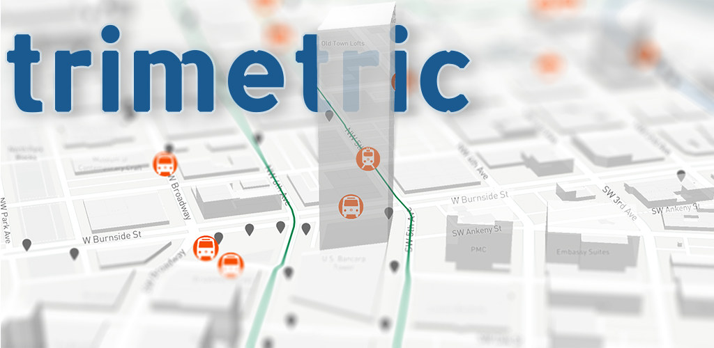

<br />

Trimetric Mobile is a [React Native] app that pulls data from a [Trimetric server]
to provide a real-time visualization of the [Trimet] transit system.

### Demo

You can download the app from [Google Play] or the [Apple App Store].
It connects to the Trimetric server running at http://trimtric.briand.co.

### Screenshots


### Setup

You can run your own build of Trimetric mobile using the standard [React Native tools]. The requirements are the same as any React Native project with the added requirement of a [Mapbox Access Token].

# To get started

First, clone the repo:

```sh
git clone https://github.com/bsdavidson/trimetric-mobile.git
cd trimetric-mobile
yarn install
```

Then edit `App.js` and add your Mapbox access token.

```
Mapbox.setAccessToken("YOUR-MAPBOX-KEY")
```

If you are running your own Trimetric server, edit `data.js` and change:

`const BASE_URL = "https://trimetric.briand.co"`

to point to your running instance.

### Running

To run it in an iOS simulator:

```sh
react-native run-ios
```

If you have ADB installed and a properly configured Android device, you can run it there by typing:

```sh
react-native run-android
```

[trimet]: https://trimet.org
[google play]: https://play.google.com/store/apps/details?id=com.trimetric_mobile
[apple app store]: https://itunes.apple.com/us/app/trimetric-mobile/id885567067
[gtfs]: https://developers.google.com/transit/
[mapbox]: https://www.mapbox.com/
[mapbox access token]: https://www.mapbox.com/signup/
[trimetric server]: https://github.com/bsdavidson/trimetric
[trimet api key]: https://developer.trimet.org/appid/registration/
[react native]: https://facebook.github.io/react-native/
[react native tools]: https://facebook.github.io/react-native/docs/getting-started.html
